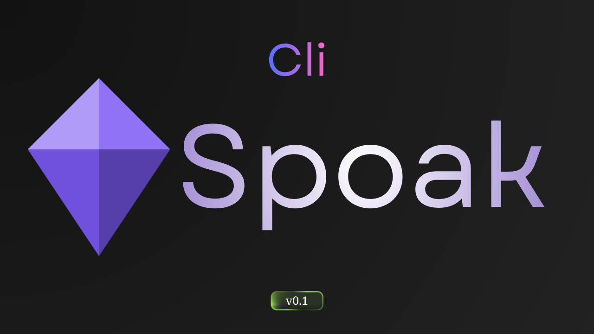

# Spoak CLI v0.1

Minecraft sunucu yöneticileri ve oyuncuları için terminal tabanlı araç koleksiyonu. Rust ile geliştirilmiş, [spoak-backend](https://github.com/spoakk/backend) ile çalışır.

[](https://github.com/spoakk/backend)

## Özellikler

- **Tek Binary** — Node, Python ya da başka runtime gerekmez
- **Otomatik Backend** — İlk çalıştırmada backend'i otomatik indirir ve başlatır
- **Otomatik Güncelleme** — Her çalıştırmada GitHub Releases'i kontrol eder
- **İnteraktif Mod** — Komut satırı argümanları veya interaktif menü
- **Renkli Çıktı** — Terminal'de tam renk desteği

## Kurulum

### Windows (PowerShell)

```powershell
iwr -useb https://raw.githubusercontent.com/Spoakk/cli/main/install.ps1 | iex
```

### Manuel İndirme

[GitHub Releases](https://github.com/Spoakk/cli/releases/latest) sayfasından binary'yi indirin ve PATH'e ekleyin.

## Kullanım

### İnteraktif Mod

```bash
spoak
```

### Komut Satırı

```bash
# Sunucu ping
spoak ping play.hypixel.net

# Oyuncu profili
spoak player Notch

# Sunucu jar'ları listele
spoak jars versions
spoak jars paper 1.21.4

# Yardım
spoak help
```

## Komutlar

| Komut | Açıklama |
|-------|----------|
| `ping <host> [port]` | Minecraft sunucusunu ping'le |
| `player <username>` | UUID, skin ve oyuncu bilgilerini sorgula |
| `jars versions` | Minecraft sürümlerini listele |
| `jars paper <version>` | Paper build'lerini listele |
| `jars leaf <version>` | Leaf build'lerini listele |
| `help` | Yardım menüsünü göster |

## Backend Yönetimi

CLI, backend'i otomatik olarak yönetir:

- **İlk çalıştırma:** Backend'i `~/.spoak/spoak-backend.exe` konumuna indirir
- **Güncelleme:** Her çalıştırmada GitHub'dan yeni sürüm kontrolü yapar
- **SHA256 Doğrulama:** İndirilen dosyaların bütünlüğünü kontrol eder
- **Otomatik Başlatma:** Backend'i arka planda başlatır ve hazır olmasını bekler

## Geliştirme

```bash
git clone https://github.com/spoakk/cli
cd spoak-cli
cargo build --release
```

Binary `target/release/spoak.exe` konumunda oluşur.

## Teknolojiler

- [Rust](https://www.rust-lang.org) — Dil
- [Clap 4](https://github.com/clap-rs/clap) — CLI argüman parser
- [Tokio](https://tokio.rs) — Async runtime
- [Reqwest](https://github.com/seanmonstar/reqwest) — HTTP client
- [Crossterm](https://github.com/crossterm-rs/crossterm) — Terminal manipülasyonu

## Linkler

- [GitHub](https://github.com/spoakk)
- [Discord](https://discord.gg/SBbU3rCtGe)
- [Web Arayüzü](https://spoak.cc)
